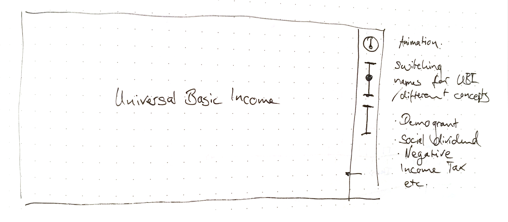
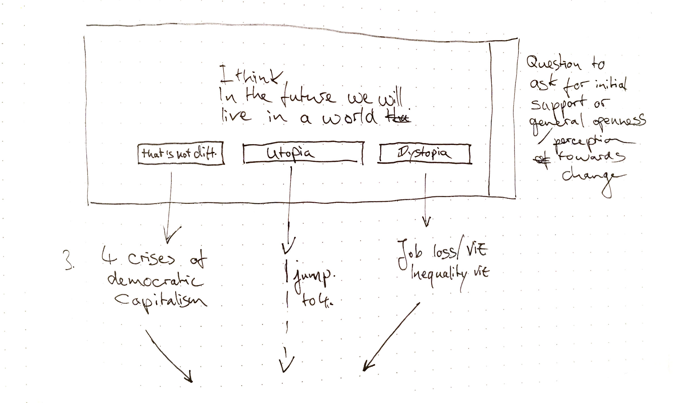
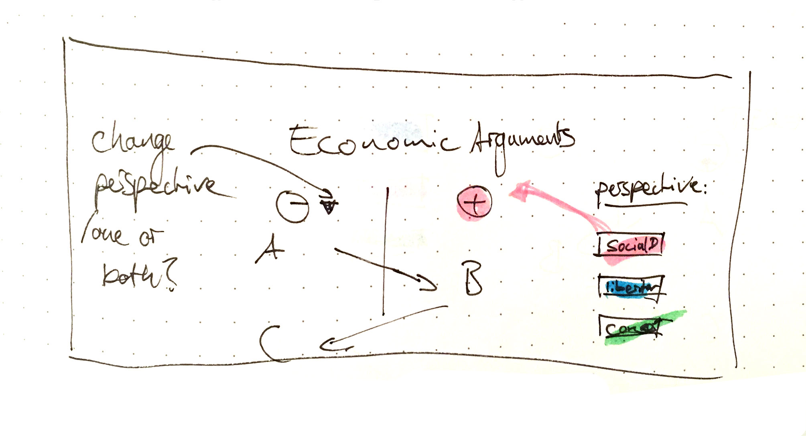
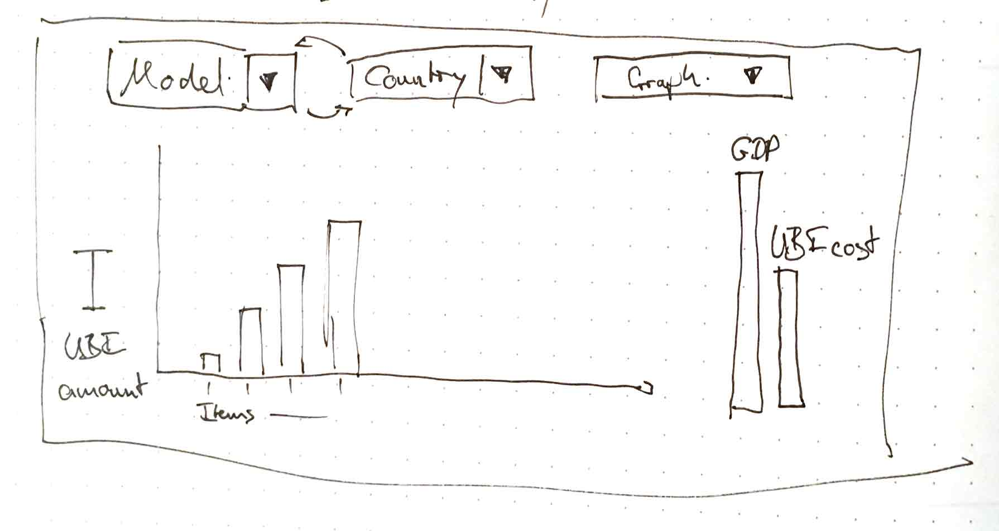
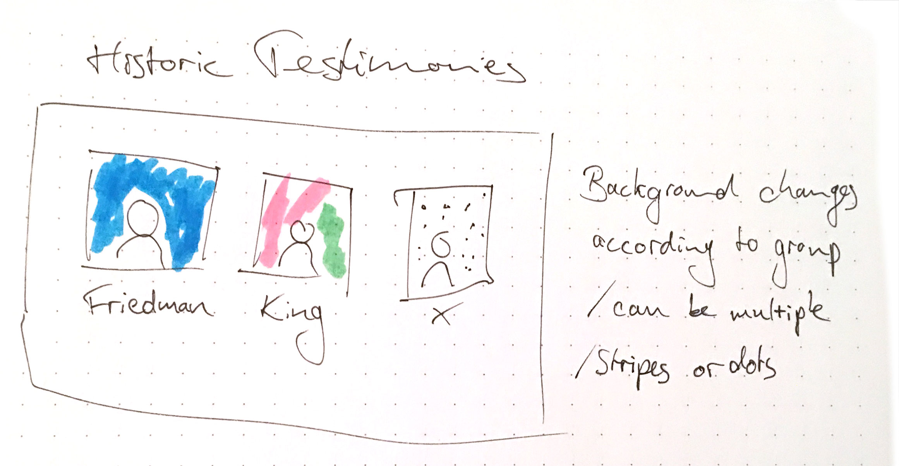
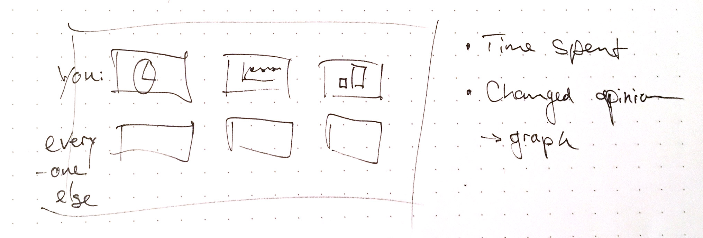

# UBI visualization outline

## Second draft

### 1. Welcome page

What do we see:
- Introduction to the layout
- Animation of words changing letters into different words:
  - Universal Basic Income
  - Social Dividend
  - Demogrant
  - Negative Income Tax
  - Freedom Dividend

### 2. Introduction to the project and the “Opinion UI”

What do we see: 
- Introductory address on what the subject is and the idea to track the opinion on UBI throughout the reading process
- Explanation of the UI functionality

### 3. Urgency of the project: What might our near future look like, if we think about recent developments?

What do we see: 
- A question about the reader’s take on the future with three possible answers (choose one)
  1. Not much will change, it’s the end of history after all
  2. Technology will bring prosperity, our perception of work will change
  3. Socio-economic and political inequalities will only get worse, we’re headed towards dystopia

### 4. According to the choice the reader gets to a visualization conflicting or supporting (haven’t decided yet) the perception.
What do we see: 
- For conflicting: 
#### 4.1. Streeck, 4 crises of democratic capitalism argument (and graph) shows that the mechanics of capitalist distribution changed various times after WWII
#### 4.2. Job loss due to automation (Yang2018, Executive Office of the President, “Artificial Intelligence, Automation, and the Economy”)
#### 4.3. Declining poverty (trickle-down)

### 5. UBI
What do we see:
- Reiteration of the Animation
- Text elaborating on different concepts of UBI, schools of thought (introducing color scheme for those)
- A table or a Venn diagram
- Defining one of those variants as working definition for the rest of the piece

### 6. Economic arguments for UBI

What do we see:
- First time we see a pro-contra juxtaposition
- Representation of a back and forth discussion
- Arguments color coded if school of thought is applicable
- Pro and contra sides can be adjusted to a particular school of thought
- Every argument can be extended to include more information, data representations and references to sources 
- Option to extend the argument?
### 7. Affordability

What do we see:
- Text on the speculative character of these calculations / models, the difference between static models and dynamic effects of the implementation of policies
- Dashboard-like visualization of different calculations for various countries
- Input, how high the UBI should / could be by the user
- Representation of the values to the scale of the GDP of that country
### 8. Domains of qualitative arguments 

What do we see:
- The domains of qualitative arguments for UBI (these are links to a detailed view of the arguments)
  - Social justice
  - Freedom
  - Prosperity
  - Security
  - Equality
- A Venn diagram or something similar to link show (very simplified) common ground and disagreements of the different schools of thought
- Conclusion that affordability is a political issue
#### 8.x. Detail of one qualitative domain of arguments
What do we see: 
- Reiteration of the pro-contra juxtaposition of arguments in the specific domain 
- Option to extend / add to the argument? 
### 9. Testimonies (historic authorities)

What do we see:
- Portraits of proponents of UBI on a background of the school(s) of thought they could be associated with and small introduction or reference to their thoughts on UBI
### 10. Dashboard as evaluation of the interaction with the site and comparison to the other readers

What do we see:
- A dashboard of the results of the tracked interaction with the site
- A button to submit the data / optional questions on demographics (age etc.)

## First draft

1. Welcome page
2. Introduction, definition, explain ToC
3. Difference between intrinsic and instrumental arguments (qualitative and quantitative data)
4. Argument map / Testimony view
5. Why now? Timelines
  4.1 A timeline of inequality (income or wealth/ or both) between 1900 and 2019, - needed as introduction, because: Universal Basic Income is an idea for a reformed social welfare system to reduce the inequality and its negative impact on society & the economy
  4.2 Current situation (implicit marginal tax rate disincentive)
  4.3 Speculations on the future
5. Affordability

## (Ideas & Notes)

### Current Situation

- Implicit marginal tax rate (Fictional Testimonies to make it more personal, emphasis on the breaks, visualize why this is 70, 80 or 90% marginal tax rate) – Is in this implicitly saying that benefits are income?

### Structure alternative: split up inequality and job loss

### Technical

_Keep in mind on the data site of the project to work with APIs, or a backend to not work by hand on the data._