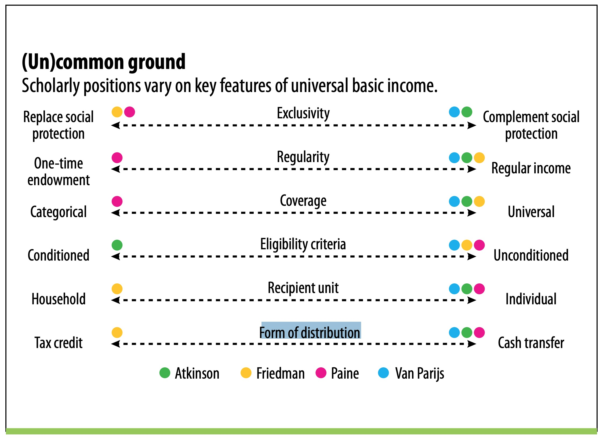

# Introduction

While historically there has been recurrent interest in the idea of a guaranteed money transfer by the government to all citizens, proponents in recent debates have suggested that technologic and socio-economic developments in recent decades render implementation of UBI feasible for the first time thanks to growing automation, if not necessary in anticipation of higher levels of unemployment and growing inequalities threatening to unravel the fabric of society. These different notions already introduce a bandwidth of perspectives on UBI where common ground still has to be found. Apart from the fact that it is a central issued money transfer one has to acknowledge that there is no universal definition of basic income as a political program yet. While this ambiguity sparks interests of thinkers of different orientation on the political compass, it can confuse arguments when the innovation of rethinking how to distribute welfare is tightly interwoven with answers to questions like which resources should be (re-)allocated, why a basic income should be considered a right and when different answers to these questions are conflated. In this paper I want to suggest that it can be beneficial to temporarily separate these concerns, undoubtedly admitting their inherent connections.

Therefore, I want to suggest four categories that offer a specific enough answer to the question what level of basic income should be granted and whether it complements or (partially) replaces current welfare programs: First, a UBI replacing current welfare entirely where current spending determines the amount of the transfer. Second, models where the basic income only partially replaces welfare (health care and education are provided to the same extent) and the amount helps to ease situations of hardship but is not enough to sustain a living. Category three builds on the second one but raises the income just above the poverty line, making it possible to sustain a modest living in areas where the cost of living is below or around the average. The last category marks the end of this spectrum where the level of basic income would be comfortable enough to render work optional.

Within each of these contexts, I try to identify the main concern the UBI models in this category want to address either in comparison or in addition to UBI models in the other categories. I want to show how Data Visualization can illustrate these concerns and the proposed solutions but also allows a unique comparison of these categories by introducing a visual method to illustrate the (re-)allocation of resources. In extension of a broadcasting paradigm I want to use the possibilities of user interaction as an opportunity to invite the user to reflect on the opinion formation process regarding the presented arguments and (re-)introduce the notion that UBI, when translated into a concrete political implementation is more than a cross-ideological distribution mechanism: like every political program it then also becomes a broader vision of “obligations we have to one another, the origins of property, the ends of human life, the shape of our society” [@battistoniFalsePromiseUniversal2017]. Nevertheless my hope is that the separation of these concerns (and contexts) helps to emphasize in which regards UBI can be regarded a tool of innovating welfare and once clarity over broader visions is established might even offer new compromises in a highly polarized political environment.

# Treatment

## What is UBI?

There is no final consensus on the question what exactly a Universal Basic Income is. I use the term UBI in the broadest sense as an umbrella term and introduce four categories that are specific enough to compare different UBI implementation plans[^ubiConfusion]. What these concepts have in common is that they are a form of “negative tax” (not a negative income tax, NIT which is a more specific concept introduced later) [@widerquistCostBasicIncome2017, 5]. A negative tax in this sense is any kind of transfer, tax reduction or tax credit, as we know already in the current welfare and taxation system [@widerquistCostBasicIncome2017, 5]. But in contrast to the historically grown convolution of current programs and policies usually targeted at a specific part of the population or designed for a concrete situation of need, UBI is an approach intended to “reach all (or a very large portion of the population) with no (or minimal) conditions” [@franceseWhatUniversalBasic2018, 38]. 

[^ubiConfusion]: In the contemporary debate different names can describe identical concepts or slight variations of similar concepts and for perfect confusion two names can be used synonymously for one concept in one context and to identify an essential distinction between two concepts in another context [@widerquistCriticalAnalysisBasic2018, 16].

Beyond these commonalities there are quite a few differences between UBI concepts, not only in regards to the justifications and goals of a UBI but also and often related to that the pragmatic functionality of this mechanism. The IMF introduced six categories of key (pragmatic) binary features to distinguish between UBI concepts that provide helpful orientation for this project: exclusivity, regularity, coverage, eligibility criteria, recipient unit and form of distribution.[@franceseWhatUniversalBasic2018, 38; @internationalmonetaryfundFiscalMonitorTackling2017, 17]. Exclusivity describes if a the transfer is intended to substitute current social protection programs or if it is regarded as complementary to existing transfers [^noExtremes]. In terms of regularity and coverage I will only look at regular, universal and unconditional programs, omitting Thomas Paine’s one-time capital grant and Atkinson’s means-tested conception. Recipient unit and form of distribution are usually linked to each other and a main difference between NIT and UBI plans: While NIT plans generally want to fit the mechanism directly to the established income tax system and use tax credits for its reference unit of one household, UBI plans emphasize universality and propose a cash transfer to individuals. In this strict definition of terms a NIT is an annual ex post benefit, while almost all UBI proposals are monthly ex ante transfers. 

[//]: # (TODO: Paine’s categorial approach, why is Atkinson’s means tested?)

{#fig:keyUBIFeatures}

Figure @fig:keyUBIFeatures shows the placements of different author’s positions along the lines of these key features. For this project I will specifically draw from Miltons Friedman’s NIT concept and Karl Widerquist’s UBI concept that is congruent to Phillipe Van Parijs’ (marked in light blue) in this scheme.

[^noExtremes]: While figure @fig:keyUBIFeatures suggests a binary classification for this feature, none of the more elaborate plans I found in the literature actually suggests an extreme position in this regard. In general UBI implementation plans lie somewhere between these extremes. Even Friedman excludes for example veterans’ benefits and “costs of public health activities, state and local expenditures on hospitals, mental institutions, and the like” [@friedmanCapitalismFreedom2002, 193]. Friedman also considers the possibility of medical expenses as tax deductions. In the other direction proponents of a UBI in addition to current welfare argue that some programs would be redundant and could their budget could be re-allocated to finance the UBI plan. See **TODO:cross-reference**

With these introductory remarks on a definition of UBI I want to take a step back and devote the next section to a broad overview over the historical, political and cultural context of discussing the idea of a BIG in the US and conclude with a formulation of my approach how to talk about this idea in the scope of this project. After the small detour I continue with my analysis  by introducing four categories of detailed BIG plans, identifying the problems that addressed within these categories, the possible BIG solution and visualizing the re-allocation of the current budget.

## Historical and cultural context

[//]: # (TODO: Explain this section)

### Why the US? – 1960/70s Nixon / Carter, closest to an implementation of UBI

[//]: # (TODO: The US has a history in the basic income debate)
[//]: # (TODO: Summarize)

### Me talking about UBI in the US right now

Starting this thesis project with a bit of German naivité, I thought it would be great to devote my efforts on an idea that is gaining attention in recent debates and in an increasingly polarized environment had support from people of very different, usually antagonistic political camps. To me it was immediately intriguing when Rutger Bregman or Andrew Yang explain, that John Stuart Mill, Bertrand Russell, Milton Friedman and Martin Luther King had supported the very same idea and when Elon Musk and Mark Zuckerberg jump onboard it made it look like an easy argument to present UBI as an idea, whose time has come (again). Of course everything turns out to be more complex than it initially seems. Consulting with the great peers and my outstanding professors at Parsons, it soon became clear that the topic when touching on themes of redistribution, can escalate into a political minefield very fast. Political labels should probably avoided when possible to avoid alienating readers early. And I realized that it would be wrong to say that there’s already a support for UBI across the political spectrum instead it would be more accurate to say that in across political orientations there are niches that share some core political beliefs that make the approval of a UBI concept more likely,[^conflictingBeliefs] while there are some widely held beliefs across the political spectrum (maybe not reaching to the very left edge) that make the support for UBI highly unlikely. 

[^conflictingBeliefs]: And conflicting beliefs are not necessarily touched by a UBI concept, or these concerns can be separated theoretically, although it’s highly unlikely that they can be separated pragmatically, to present an argument for this view is also part of the goal of this project.

### Pitfalls and delicacies when talking about UBI in the US. 

#### When is it possible to think about a UBI and when is it not?

In his book on the failure of guaranteed income policies, Ben Steensland describes the possibility of a debate of UBI in 2008 like this:

> “The idea of providing basic economic security to all Americans (or even just American families) is not debated today, first and foremost, because it is _unthinkable_(!). It is currently beyond the pale of American political discourse”  
> [@steenslandFailedWelfareRevolution2007, 8]

What has happened in the last decade, that it seems possible to re-introduce the idea of UBI? And is it really possible? To answer this question it’s important to know what rendered the idea of providing basic economic security to all Americans _unthinkable_ first. Steensland provides a method of analysis for this task by identifying the cultural categories of the “deserving” and “undeserving poor [@steenslandFailedWelfareRevolution2007]. These allow to distinguish between people who deserve charity and welfare transfers, because despite their best efforts they were a target of bad fate, form people who are just too lazy or defiant in other regards to sustain a living by themselves and their moral inferiority should not be compensated with transfers but instead re-socialization is the best measure to help this group of people to help themselves.[^helpingToSustain] Although the description of this belief sounds conservative and has certainly partially roots in predestination in calvinism[^religiousInfluences], it’s also widespread left-of-the-center in unions, regarding full employment an essential economic goal, in the 1990s’ “Third Way” programs of Democrats and Labour, replacing welfare with “workfare”, and in the self-awareness of the working class, taking pride in their stoic work ethics. Steensland argues that a guaranteed income fundamentally challenges the distinction between “deserving” and “undeserving” by generalizing transfers. Regarding the efforts to introduce a basic income guarantee in the 1960s (under Nixon) and 1970s (under Carter) he summarizes the reason why they eventually failed:

> “This challenged the political, economic, and cultural status quo: it presumed that previously separate categories of the poor were morally equivalent to one another; it called into question existing definitions of ‘welfare’; it created a new category of government beneficiary (the ‘working poor’); and it rested on the premise that the labor market could not serve as the sole source of economic security for the nation’s able-bodied citizens. After the failure of Nixon’s proposal, legislators responded to the threats posed by GAI plans by creating new antipoverty programs – Supplemental Security Income and Earned Income Tax Credit – that institutionally reinforced categories that Nixon’s plan had threatened to dismantle.”  
> [@steenslandFailedWelfareRevolution2007, 15]

[^helpingToSustain]: In regards to charity Andrew Carnegie’s “The Gospel of Wealth” comes to mind. 
[//]: # (TODO: Check or delete)
[^religiousInfluences]: This belief takes a more radical shape in Prosperity Theology. While most people won’t share these beliefs explicitly they are part of a larger cultural theme. Compare also to Max Weber “The Protestant Ethic and the Spirit of Capitalism”
[//]: # (TODO: Check or delete Weber)

I would argue that the abandonment of guaranteed income concepts and the institutional reinforcement of the categories of “undeserving” and “deserving” also re-established trust in the labor market, in self-directedness in regards to economic success and basically the self-made narrative of the American Dream (if “failure” is individual, there’s no reason to think of systematic failures). When the firmness of this belief (system) renders an income guarantee unthinkable thoughts and consequently public debates about this idea don’t emerge on the sole basis of the idea itself, but due to external stress on the belief system.[^myArgument1960]. If it’s true that UBI is only thinkable when the belief in _this_ American Dream is weakened and there is current debate around UBI, then this belief must have suffered from internal or external stress. In case of the US there are several developments in recent decades that arguably led to some erosion of the belief that the free market (still) provides equal opportunities for all: Skill and job polarization, falling real wages for the bottom half of incomes, unchanged poverty rates. While these developments are happening across OECD[^oecd] countries, they are amplified by what is discussed in economics & politics literature as American Exceptionalism[^sombart], a historical debate around the curiosity that in contrast to other industrial country never had a strong socialist movement or party that David Soskice revisited arguing that decentralization and weak party discipline in the US mutually reinforce each other and facilitate business permeation of politics. [@soskiceAmericanExceptionalismComparative2010] A diagnosis shared and heavily criticized by former Secretary of Labor Robert Reich[^reich] reflecting how extensive lobbyism questions the legitimacy of capitalism in democracies – a sentiment that manifests in the more popular formulation of “the feeling that the system is rigged” 

[^myArgument1960]: Of course this conviction would have to be tested historically. I would need to clarify what kind of stress there was on the belief system in the 1960s, but that’s beyond the scope of this paper.
[^sombart]: A term rooted in the debate around Werner Sombart’s seminal piece “Why Is There No Socialism In The United States?”[@sombartWhyThereNo1906] I’ll focus on the Soskice’s argument [@soskiceAmericanExceptionalismComparative2010] on how decentralization and weak party discipline reinforce each other and lead to a middle-class preference for Republican candidates, business permeation of politics and local class-sorting and consequentially to weak performance of the US in the domains of unionization, inequality, literacy, and incarceration in OECD comparison. 
[^reich]: For example recently in a Netflix documentary [@jacobkornbluthSavingCapitalism2017] based on his book “Saving Capitalism” [@reichSavingCapitalismMany2017]

[//]: # (TODO: Job polarization, growing fear of automation)
[//]: # (TODO: Check on Unemployment, Yang)
[//]: # (TODO: Check on poverty… since)
[//]: # (TODO: Check on Black lives matter)
[//]: # (TODO: Financial crises and “easing”)
[//]: # (TODO: Political polarization)

### Learnings from the historical debate: a pragmatic approach {#sec:myApproach}

Learning from this research and my own experience of a polarized political environment I want to try a new approach to introduce the idea of UBI to a broad audience. as a way to rethink social welfare that might help “fix” problems that current welfare programs (like welfare cliffs or administrative complexity and costs) face or might help to prepare for future challenges (growing unemployment due to automation). While working on UBI I often got distracted by asking myself, what my own stance on UBI really is, what arguments are convincing to me and how articles and formats addressing a general audience have supported my opinion formation process. I was wondering, if it was important to me who (from which political orientation) says what and how. I read a lot of articles advocating for or against a specific flavor of UBI, presenting arguments for and against in a more or less nuanced fashion and often concluding with one argument that is meant to convince me as a reader of the author’s opinion and close the case.[**TODO:references**] Other formats try to put a stronger emphasis on information about the status quo in current UBI debates, but by listing all the arguments out there sometimes fail to make connections or incompatibilities transparent.[**TODO:references**] While some authors use the buzz words to identify political camps or orientations like conservatives, libertarians, liberals, progressives etc. others try to avoid this buckets and try to find more specific formulations for political beliefs.[**TODO:references**]

Although I learned a lot from comparing these approaches, I think to leverage the opportunities of a data-driven narration I need to expand the possibilities of user interaction to allow for a higher level of engagement of the reader.

From an interaction or level of engagement point of view I think it’s possible to think of at least three distinct approaches to address an audience, setting different roles for the author and the reader.

In a first approach the author provides all the information and evaluation of arguments and the readers have the role of a stake-holders (a deciders) who determine if the presentation and arguments are valid and whether they agree or not. This approach can be extended to more than a binary choice and might also include a classification where an agreement comes with the association to a group. The author may validate or discredit the readers prior self-identification with a certain group, when they agree or disagree with an argument that a member of a this group would usually make. 

In a second approach the author would also provide information and arguments, but would omit their own weighting and overall conclusion. Ideally connections are made, where arguments are congruent or compatible and distinctions and differences are emphasized where necessary. The readers in this case take the role of curators choosing a combination of parts of the argument and can make their own case for or against the cause.

The third model doesn’t provide all the information and omits most of the arguments. The author refuses the role of a problem solver but instead tries to provide the best framework to understand the problem and find ways to solve them. Of course this author still frames the possible solutions and also defines what is regarded as a problem in the first place, but within this frame the readers are relatively free to come to own conclusions and discover not only information about the problem but also detect patterns of their decision making which can provide the space to reflect on underlying (moral, political) beliefs. Translated to the realm of design, the author becomes a meta-designer [@mulRedesigningDesign2011] creating a space for users to become a designers themselves a role that can be especially empowering in a political context, when (detailed) proposals can be made by a larger audience instead of only experts that have the necessary skills to make estimates. If the designs users made could be shared, adjusted and discussed in an easily accessible way another level of engagement in discussing policies could be possible.

#### Subhead

- Cross-reference approach: 
  - present the policy and the outcomes and 
  - let people decide whether it’s good or bad 
  - instead of telling them what other people think is good or bad, 
  - their political beliefs will show up anyway, 
  - but are probably way more nuanced than the usual buckets

#### Accounting for bias: my qualitative approach to UBI

Summarizing the history of the idea of a universal basic income is already a political (and academic) Rorschach test. Anyone who doesn’t want to loose the vast majority of even their most well-meaning readers probably wouldn’t mention Paul Lafargue’s “The Right To Be Lazy”, although it might be the first historical example of rethinking our relation to work in face of general automation. So let me start with that:

> Aristotle’s dream is our reality. Our machines, with breath of fire, with limbs of unwearying steel, with fruitfulness, wonderful inexhaustible, accomplish by themselves with docility their sacred labor. And nevertheless the genius of the great philosophers of capitalism remains dominated by the prejudice of the wage system, worst of slaveries. They do not yet understand that the machine is the saviour of humanity, the god who shall redeem man from the sordidae artes and from working for hire, the god who shall give him leisure and liberty.  
> [@lafargueRightBeLazy2016, 84]

## Introducing four entry points to the UBI discussion 

For this project I want to present four entry points to the UBI discussion. Trying to avoid initial ideological biases I want to introduce each of the entry points with a problem that’s suitable to be presented with data. After the problem and the reasons why it is considered a problem are presented, I visualize how a UBI plan could be a solution to this problem. The sequence of my presentation follows a progression of the intended grant levels of different UBI plans taking into account to what extent the UBI should be granted in addition or as a substitution to current welfare programs. 

In the first model I selected the “cliff effect” of welfare benefits where an increase in market income leads to bump in net income due to lost eligibility in benefits. The grant level in this model is just as high as the amount of current welfare spending that is considered substitutable divided by the number of targeted beneficiaries (for example the 10 % of the population with the lowest incomes). This model refers to Michael Friedman’s conception of a Negative Income Tax (NIT) in is work _Capitalism & Freedom_ [@friedmanCapitalismFreedom2002]. I update his calculation with current budget spending and census data, but follow the general approach. The solution is presented as a line-graph mapping market income (earnings) to net income which shows a smooth progression as income increases in contrast to the “cliff effect” of current welfare. Each section will conclude with a graph that shows the re-allocation of budget spending, comparing current spending and a theoretical budget with the UBI implementation.

The second model includes UBI plans that are considered partial, transitionary or experimental. The problem presented in regards to this model is a data problem on a meta level, it’s not possible to completely test and predict the effects of a policy that implies such a fundamental change of transfers and taxation as UBI does. Acknowledging the inherent limitations of UBI research, I give an overview over currently available empirical findings and refer to the analysis of Karl Widerquist what is possible to expect from new case studies [@widerquistCriticalAnalysisBasic2018]. As possible solutions to this problem I present opt-in or transitional strategies that ease the transition from the current welfare system to a UBI model.

Most popular in current debates are models of the third category that promote a grant level that is just above the poverty line. For an adult in the US that would currently mean 1.000 $ a month or 12.000 $ annually. The problem addressed by this model is obviously poverty. While there has been a significant drop of poverty by almost a half in the 1960s, also as a result of the War on Poverty (by Lyndon B. Johnson), the poverty rates have been fluctuating between 11 and 15.2% ever since[^povertyRatesDetail], proofing that the current welfare system is inefficient to address poverty completely. With Widerquist’s model I want to visualize how UBI would affect different income groups and practically eradicate poverty by “raising the floor” [@widerquistCostBasicIncome2017]. I also use Widerquist’s approach and visualize how much a UBI would cost “in a vacuum”. Then I introduce different proposals how this costs could be integrated in the current national budget and ideas for new ways of financing a UBI. In addition the users are given the opportunity to develop their own UBI financing scheme, which they can submit in the end and that can be rated by other readers.

[^povertyRatesDetail]: Poverty reduction was mainly driven by falling rates among Americans below the age of 18 and above the age of 65. [@WarPoverty2019, see also footnote 9]

The forth model is an expansion of the third raising the grant to a level sustaining basic needs rendering  work optional but also almost necessarily introduces the need for more re-distributive (new) ways of financing the UBI. The problem that has currently most attention addressed by this idea is that growing automation will cause a huge leap in unemployment. Some authors argue there is already a large number of unnecessary jobs [@bregmanUtopiaRealistsCase2016, **TODO:p**] resulting in dissatisfaction and alienation for a large part of the workforce. To address both of these tendencies a UBI would allow to distribute the profits of automation and allow people to pursue endeavors to contribute to society that don’t have to be in the form of a paid job[^genderEquality].

[^genderEquality]: A qualitative argument for UBI is the fact that there is unpaid work in the domestic space that tends to be performed by women [@parijsBasicIncomeRadical2017, 102] and is not easily transformable into paid work (for example, who would monitor the work?). A UBI would acknowledge and compensate for this difference.

As layed out in section [@sec:myApproach] I want to use a data-driven approach to design a framework where users can learn about a problem and try to solve it where a UBI approach can be one possible solution. Amongst the range of possible problems[^possibleProblems] to discuss I chose those where the consensus that it is considered a problem seems to be the broadest: the welfare trap, poverty, growing unemployment and alienation from work.[**TODO:references**] 

[^possibleProblems]: Possible problems that could be addressed by a UBI plan are amongst others: Opaqueness of current welfare programs, complexities and administrative costs, the welfare trap and cliff effects of social benefits, gender pay gap and inequalities of unpaid work, job polarization and growing unemployment due to automation, poverty and related costs, alienation, the relation between inexistent safety nets, freedom and equal opportunities, private ownership of common goods and new justifications for socio economic (re-)distrubtion

I then want to follow a progression from problems that allow an introduction to basic UBI concepts and models that have the most compatibilities to current welfare systems to problems that reach the limits of current welfare systems and models that introduce new ideas of financing elaborate UBI plans. 

### Model 1: Can replacing current welfare with a Negative Income Tax solve the welfare trap?

For this model I want to introduce the problem called “welfare trap” and the framework of a possible solution is Michael Friedman’s methodology of a Negative Income Tax (NIT).

#### Problem: Welfare cliff

The welfare trap describes the problem that in current welfare systems there are cliff effects when recipients are able to improve their earnings situation (market income) beyond certain thresholds they suddenly become ineligible for a benefits resulting in a drop of their net income. It is regarded a problem by advocates and critics of a UBI all over the spectrum[**TODO:references:Cato,**] and different government levels have issued reports on this problem [TODO:ref:Pennsylvania,Illinois,Massachusetts,CBO]. While some people argue that it puts unnecessary burden on people trying to sustain a living on their own and use the welfare trap to refute the argument of the lazy poor, others that tend to regard social welfare as an undesirable disincentive to work, denounce the fact that somebody earning more (“working harder”) should be worse off than someone earning less.
- Pennsylvania etc. (Complexity of the benefit calculation vs simple formula)

- Don’t forget bureaucracy (it’s for libertarians and egalitarians)
  
- From a designer’s point of view: 
  - Trying to omit the deserving / undeserving argument, although it’s not really possible
  - Lowest obstacle, barrier

- Note: Friedman argues for his plan with the alleviation of poverty, but that point is stronger with Widerquist

- Cross-reference approach: 
  - present the policy and the outcomes and 
  - let people decide whether it’s good or bad 
  - instead of telling them what other people think is good or bad, 
  - their political beliefs will show up anyway, 
  - but are probably way more nuanced than the usual buckets
- Why this problem, why this solution 

#### Solution: A simple NIT scheme, replacing welfare

Although Friedman didn’t argue for a complete replacement of welfare by a negative income tax, he is often referred to holding this position. I think the reason for this attribution is his methodology. – In contrast to most UBI approaches that start with a specific grant level and propose an appropriate financing scheme accordingly, Friedman identifies which elements of welfare should be replaced by a universal tax credit. He then chooses a threshold of beneficiaries[^recipientThreshold] and divides the sum of the new discretionary budget by the amount of recipients of the tax credit according to the threshold. 

[^recipientThreshold]: He mentions three possibilities: the lowest tenth, fifth or third of incomes. 

#### Re-allocation of the budget and estimated effects on incomes: 1961

#### Re-allocation of the budget and estimated effects on incomes: update for 2019

#### Data, Interactivity

#### Model conclusion and why a comparison with a UBI model might be helpful

- NIT: annually, most social benefits are paid monthly, when the money is actually needed
- NIT is “safe” because benefits are calculated in retrospect, but the simplification of taxation it could introduce makes it easier to plan also in a UBI scheme

### Model 2: (For the thesis a further reduction to 2 models might make sense)

### Model 3: Can a Universal Basic Income alleviate poverty?

# Conclusion

# Bibliography
